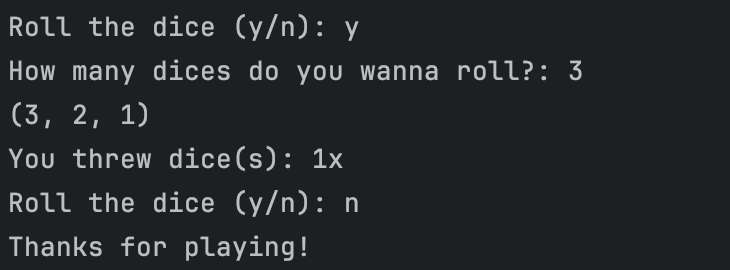
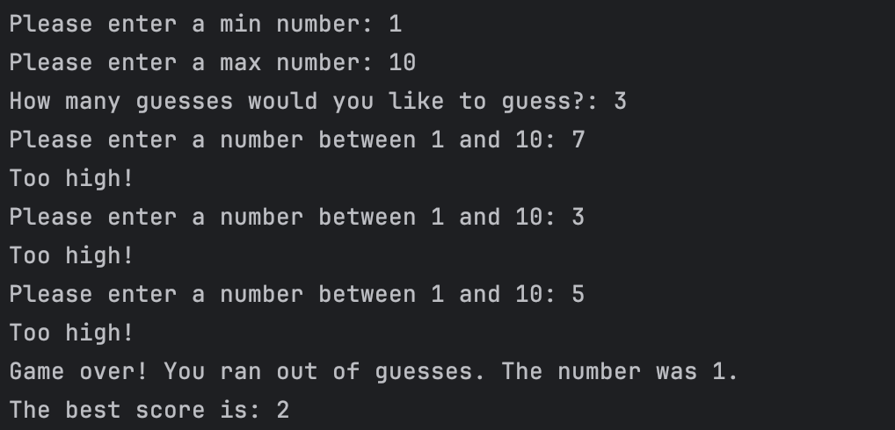
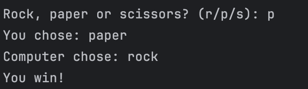

# Python Mini-Games Playground

This repository is a collection of simple Python mini-games. 

**Purpose:**

* 📚**Learning:** This is primarily a playground for learning and experimenting with Python. 
* 💻 **Practice:** Practice core Python concepts (e.g., loops, conditionals, functions, input/output).
* 🎲 **Fun:** Enjoy some quick and easy-to-play games. 

**Disclaimer:**

* This repository features simple Python mini-games, each contained within a single file to emphasize core concepts and learning.
* These games are not intended to be production-ready or highly sophisticated. 
* They are meant for educational and recreational purposes.

**Games:**

**Dice rolling game**

The Dice Rolling Game is a simple and entertaining game of chance. Players can simulate rolling one or more dice, observing the outcomes.

**Number guessing game**

The Number Guessing Game for is a fun and engaging game where a computer chooses a secret number within a predefined range. The player then attempts to guess this number within a limited number of tries.

After each guess, computer provides feedback, indicating whether the guess is too high, too low, or correct.

**Rock Paper Scissors**

Rock-Paper-Scissors is a classic hand game where two players simultaneously choose one of three hand gestures: rock (a closed fist), paper (an open hand), and scissors (two fingers extended to form a V-shape).

The rules are simple:

    Rock crushes Scissors: Rock wins against Scissors.
    Scissors cuts Paper: Scissors wins against Paper.
    Paper covers Rock: Paper wins against 1 Rock. 
    If both players choose the same gesture, it's a tie.

